# Love Beauty
**Introduction**

Love beauty is part of Code Institute's Portfolio Project 1 - HTML/CSS Essentials.
It is intended for women who want to buy makeup products and contains some information about it.

## UX
**Project goals**
- Making a static front-end website for users who want to purchase makeup products with present          useful information to users about products using HTML/CSS.
- Creating a website that is easy to navigate and easy to understand.
- The customer experience has to be great on every device and browser.
- I am creating the Love Beauty site for users to make orders and buy makeup products.

**Wireframe Design**

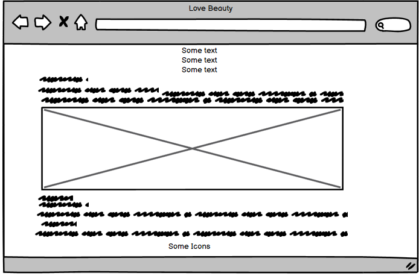

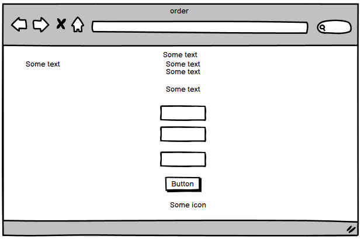

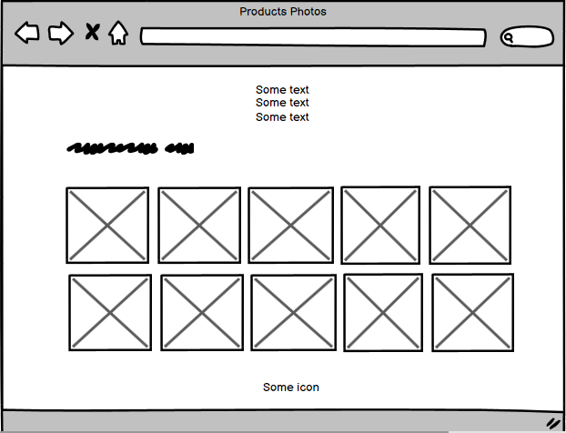

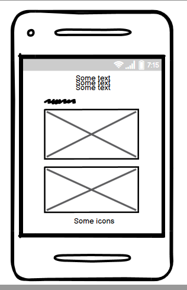

## Existing Features
**Navigation Bar**

- Featured on all three pages, the full responsive navigation bar includes links to the Home page, Product Page, and Order Page for easy navigation.
- This section will allow the user to easily navigate from page to page across all devices without having to reverse to the previous page via the back button.
- My site title is shown underneath of nav bar. The navigation bar items are positioned on the center side of the screen and aligned in the center of the bar.
They give access to the Products and Order pages. The navbar is displayed in the same way as the desktop view.

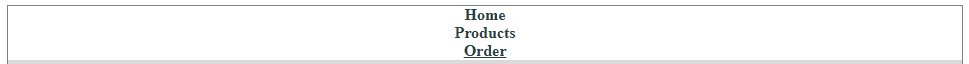

**The Main Text**

The main text includes content about the importance of wearing makeup and the website's purpose.

**The Main Image**

The main image includes one photo of a makeup package which helps users to understand the site's purpose.

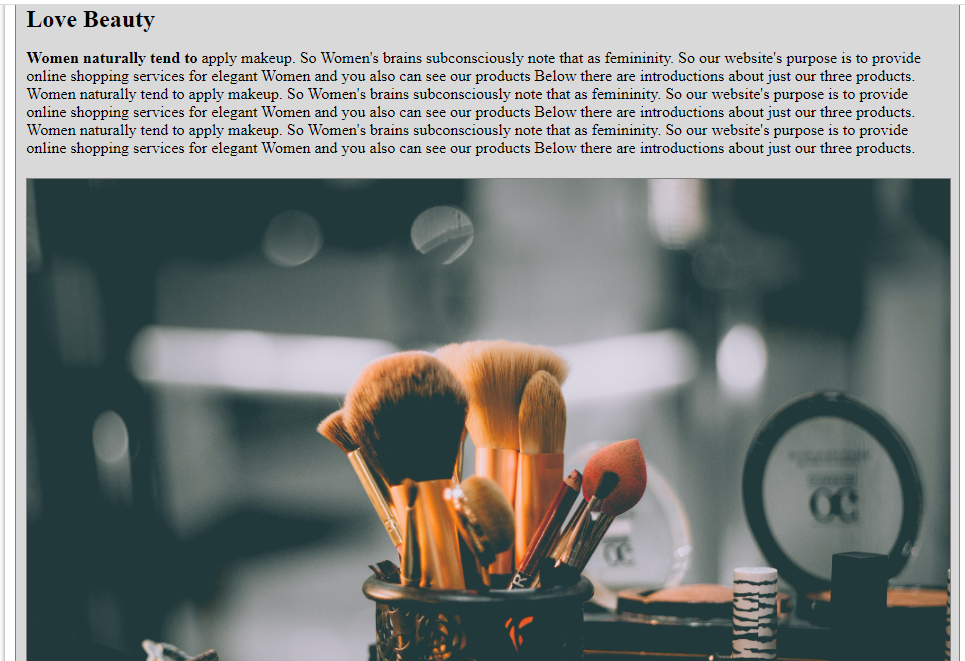

**Informaitonal section**

This section introduces our just three products.

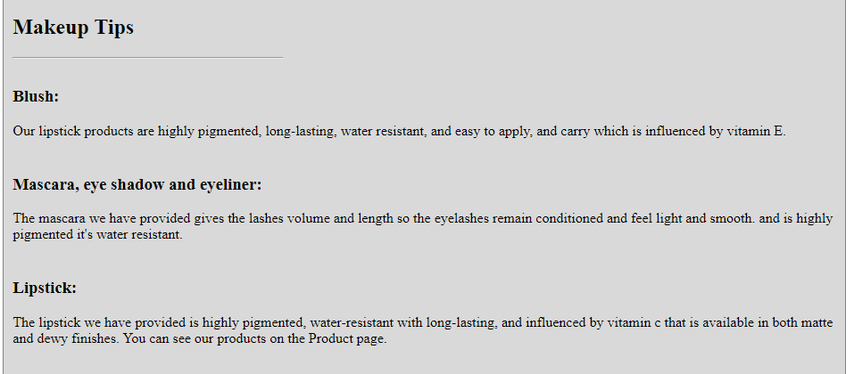

**The Footer**

The footer section includes links to social media sites. The links will open to a new tab to allow easy navigation for the user.

**Product Page**
The Product page provides a gallery of product images to see what we provide to users.

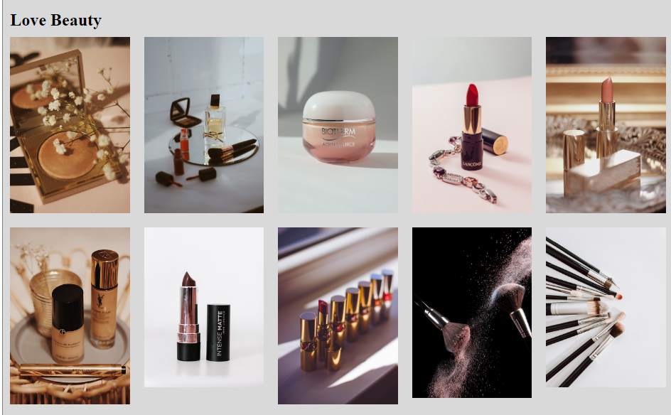

**Order Page**

The order page enables users to fill out the form and make an order.

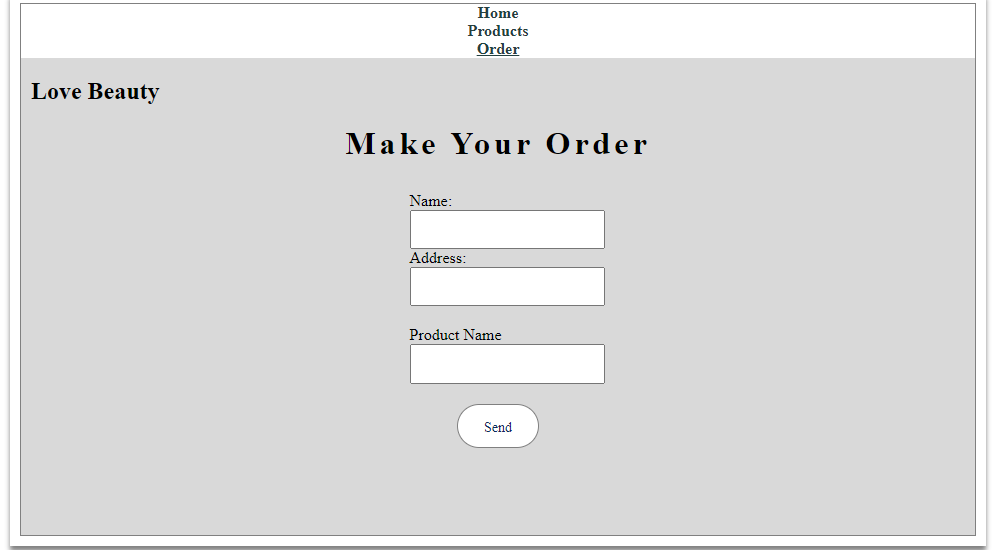

**Features Left To Implement In The Future**

As this project is designed to build a static front-end that demonstrates the skills I have developed using CSS3, and HTML5. I would add the price of each product and the way of applying makeup.

## Testing
**Validator Testing**
 **HTML**
 
- W3C validator
- No errors were found.

**CSS**

- Jigsaw validator
one error was found but I couldn't handle it cause some issues were found in the output then didn't remove it is one closing curly bracket.

## Lighthouse Test
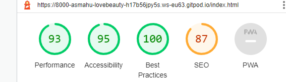
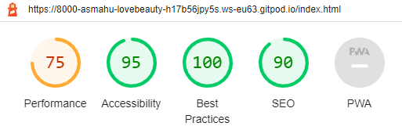

**Features Left To Implement In The Future**

As this project is designed to build a static front-end that demonstrates the skills I have developed using CSS3, and HTML5. I would add the price of each product and the way of applying makeup.

**Browser compatibility**

- I tested the appearance and responsiveness of 3 browsers (opera, chrome, and firefox) and it showed good results in all browsers.

**Test the Navigation Bar between Desktop and Mobile**

- The view and position of smartphones and tablets' navigation bars are the same as on desktops.

**Test the Footer**

- I placed the social media icons in the center of the footer. I tested all the links and they all worked well. The social media links each open in a separate tab.

**Navigation Testing** 

All links open in a separate tab.

**Deployment**

In the Github repository, navigate to the setting tab.
From the source section drop-down menu, select Master branch.
Once the master branch has been selected, the page will be automatically refreshed with a detailed ribbon display to indicate the successful deployment.
The live link can be found here.

**Credits**

I highly appreciate the slack community and CI for helping me to solve any problem during this project.

**content**

I often look for help in StackOverflow Community when I get stuck.

**Media**

[wwww.w3school.com](www.w3school.com)

[www.unplash.com](www.unplash.com)

[www.purple.com](www.purple.com)

[www.topbeauti.com](www.topbeauti.com)

[www.harpersbazar.com](www.harpersbazar.com)
